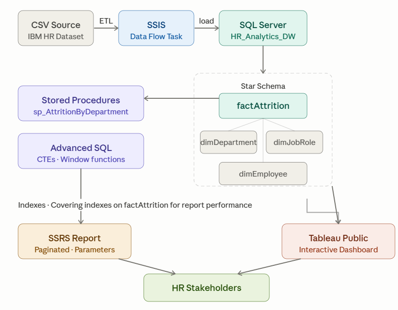
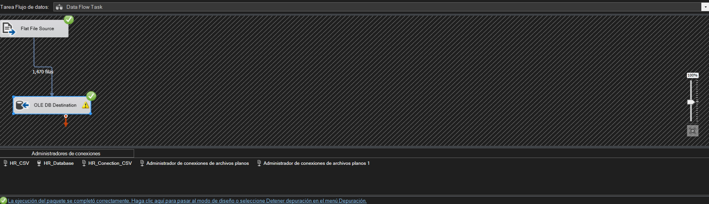
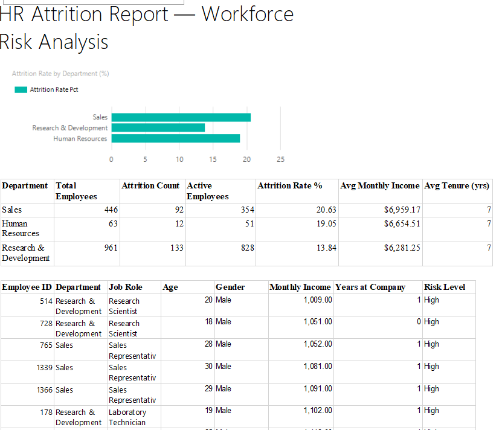
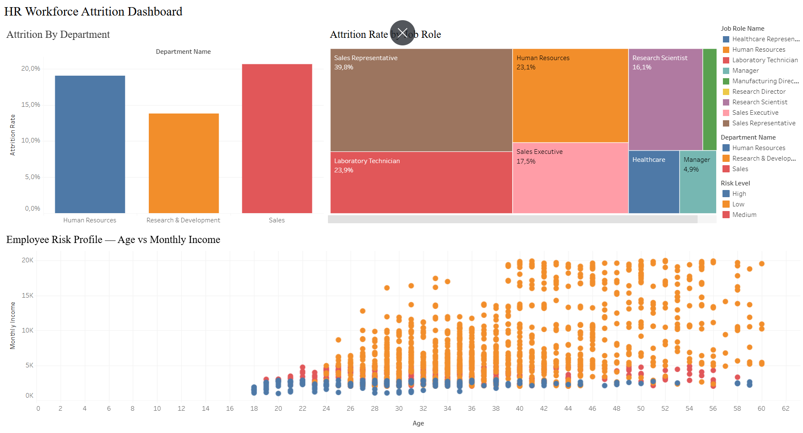
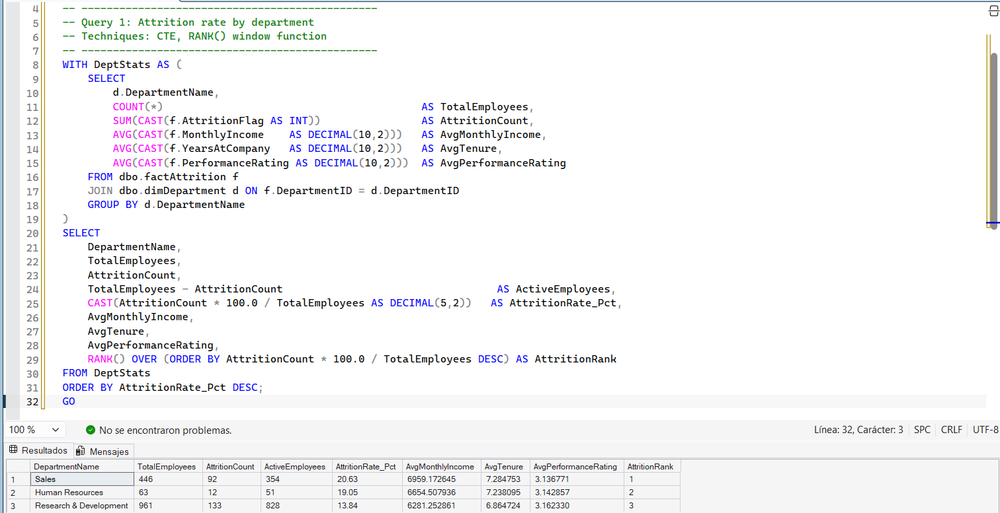

# HR Analytics Pipeline – Workforce Attrition & Performance

## Overview
This project builds an end-to-end data pipeline for HR analytics. It extracts employee data, transforms it using SSIS, loads into SQL Server (star schema), and produces interactive dashboards (Tableau) and paginated reports (SSRS).

## Business Problem
HR needs to understand:
- Which departments have the highest attrition?
- Does performance rating correlate with leaving?
- What profiles (age, distance from home, salary) are more likely to leave?

This pipeline delivers a reusable, automated solution to answer these questions.

## Tools & Technologies
- **SQL Server** (database, T-SQL, indexing, stored procedures)
- **SSIS** (ETL from CSV to SQL)
- **SSRS / Power BI Report Builder** (paginated reports for operations)
- **Tableau Public** (interactive dashboards)
- **GitHub** (version control, portfolio)

## Dataset
Source: [IBM HR Analytics Attrition Dataset](https://www.kaggle.com/datasets/pavansubhasht/ibm-hr-analytics-attrition-dataset)  
- 1,470 employees, 35 features
- Includes: Attrition (Yes/No), Department, JobRole, MonthlyIncome, YearsAtCompany, PerformanceRating, Age, DistanceFromHome

## Live Dashboard
🔗 [View Interactive Dashboard on Tableau Public](https://public.tableau.com/views/HR-Workforce-Attrition-Dashboard/HRAttritionDashboard?:language=es-ES&publish=yes&:sid=&:redirect=auth&:display_count=n&:origin=viz_share_link)

## Architecture
datasets/*.csv → SSIS (Data Flow) → SQL Server (Staging → Dim/Fact) → SSRS / Tableau

## Repository Structure
HR-Analytics-Pipeline/
├── datasets/               # Raw CSV + Tableau export CSV
├── sql_scripts/            # Table creation, indexes, stored procs
│   ├── 01_Populate_Star_Schema.sql
│   ├── 02_Indexes.sql
│   ├── 03_Advanced_Queries.sql
│   └── 04_Stored_Procedures.sql
├── ssis_packages/          # .dtsx ETL package
├── ssrs_reports/           # .rdl paginated report
├── tableau_dashboards/     # .twbx workbook
├── docs/                   # Screenshots, architecture diagram
└── README.md

## Key SQL Techniques Demonstrated
- Window functions (`ROW_NUMBER()`, `NTILE()`, `LAG()`, `RANK()`)
- Nested CTEs for department-wise attrition aggregation
- Covering indexes for reporting performance
- Stored procedures with optional parameters for SSRS datasets

## Dashboard Highlights
- **Attrition by Department**: Sales leads at 20.6%, HR at 19%, R&D at 13.8%
- **Attrition by Job Role**: Sales Representatives highest at 39.8%
- **Risk Profile**: Young, low-income, short-tenure employees flagged as High risk
- **Interactive filter**: Click any department to filter all charts

## SSRS Report Features
- Paginated report with department summary table
- Employee risk list with High/Medium/Low classification
- Parameters: filter by Department and Risk Level
- Export to PDF and Excel

## Setup Instructions
1. Install SQL Server Developer Edition + SSMS
2. Install Visual Studio Community with SSDT (SSIS)
3. Install Power BI Report Builder
4. Install Tableau Public
5. Clone this repo
6. Run `sql_scripts/01_Populate_Star_Schema.sql`
7. Run scripts 02, 03, 04 in order
8. Open SSIS project (`.dtproj`) to load data from `datasets/`
9. Open `ssrs_reports/AttritionReport.rdl` in Power BI Report Builder
10. Open `tableau_dashboards/HR_Attrition_Dashboard.twbx` in Tableau Public

## Sample Outputs
- 📊 [Tableau Dashboard](https://public.tableau.com/views/HR-Workforce-Attrition-Dashboard/HRAttritionDashboard?:language=es-ES&publish=yes&:sid=&:redirect=auth&:display_count=n&:origin=viz_share_link) — Attrition by department, job role, and risk profile
- 📄 SSRS Report — Paginated employee risk list with parameters

## What This Shows
- **SQL Server**: Advanced queries, star schema, optimization, stored procedures
- **SSIS/ETL**: Automated pipeline from CSV to data warehouse
- **SSRS**: Paginated operational reports with parameters
- **Tableau**: Interactive executive dashboard with filters
- **Coordination**: Project structured as if leading a small analytics team

## Progress
- [x] Repository setup
- [x] Folder structure
- [x] README
- [x] Dataset downloaded
- [x] SQL tables created (star schema: 3 dims + 1 fact)
- [x] SSIS ETL built
- [x] Star schema populated (1,470 employees)
- [x] Performance indexes created
- [x] Advanced SQL queries (CTEs, window functions)
- [x] Stored procedures (sp_AttritionByDepartment, sp_EmployeesAtRisk)
- [x] SSRS paginated report (department table + risk list + parameters)
- [x] Tableau dashboard (published to Tableau Public)
- [x] Final documentation & screenshots

## Author
Jesús Fernando Gómez Brito  
[LinkedIn](https://www.linkedin.com/in/jes%C3%BAs-fernando-g%C3%B3mez-brito-02a895279/)

## Sample Outputs

### Architecture

### SSIS Pipeline

### SSRS Report

### Tableau Dashboard

### SQL Advanced Queries
